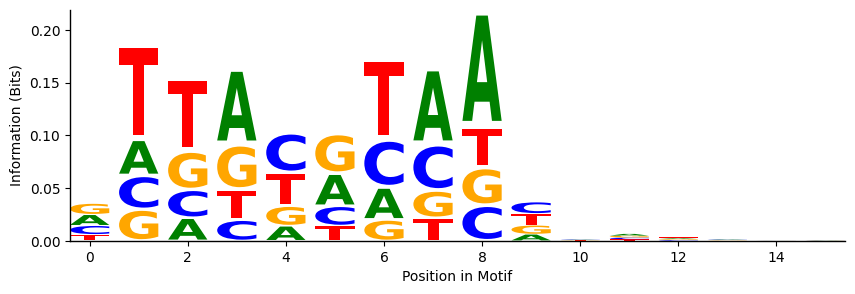
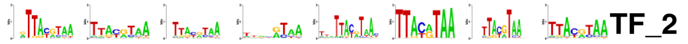

# აბსტრაქტი

ჩვენი პროექტის მიზანია, Machine Learning-ის სფეროში მიღწევები და ახალი ხელსაწყოები გამოვიყენოთ ბიოლოგიური ამოცანის ამოსახსნელად. კონკრეტულად, გვინდა, გავწვრთნათ მოდელი, რომელიც დაისწავლის თუ რა ტიპის დნმ-ის მიმდევრობებს უკავშირდება მოცემული ტრანსკრიფციის ფაქტორი და შემდეგ შეაფასებს binding score-ით ისეთ მიმდევრობებს, რომლებიც აქამდე არასდროს უნახავს. ჩვენი პროექტი დაფუძნებულია 2015 წლის ფუნდამენტურ სამეცნიერო ნაშრომზე **Predicting the sequence specificities of DNA- and RNA-binding proteins by deep learning**(https://www.nature.com/articles/nbt.3300), რომელშიც ავტორებმა შეიმუშავეს CNN მოდელი, სახელად **DeepBind**, და აჩვენეს, რომ ძველ მიდგომებს ბევრად ჯობია სხვადასხვა მეტრიკებით. ჩვენი ვაპირებთ, ჯერ გავიმეოროთ ავტორების ექსპერიმენტი **DREAM5** dataset-ზე და შემდეგ შევეცადოთ მათი მოდელის გაუმჯობესება.

# ექსპერიმენტის აღწერა

## DREAM5 Dataset

DREAM5-ში მოცემულია Protein Binding Microarray(PBM)-ში ჩატარებული ექსპერიმენტის შედეგები, რომელიც გვაჩვენებს თუ რომელ დნმ მონაკვეთებს რა ინტენსივობით უკავშირდება სხვადასხვა ტრანსკრიფციის ფაქტორები. ტრანსკრიფციის ფაქტორებზე დამატებულია ფლუორესცენციური tag-ები. მნათობი ცილები დნმ-ის სხვადასხვა მონაკვეთს უკავშირდება და საბოლოოდ თითოეული 40 ნუკლეოტიდიანი მონაკვეთის ფლუორესცენციის ინტენსივობა ითარგმნება მაგ მონაკვეთის **binding score**-ში. მონაცემების შესაგროვებლად გამოიყენეს ორი სხვადასხვა დიზაინის PBM:

- ME (Mintseris-Eisen)
- HK (Hilal Kazan)

თითოეული დიზაინს თავისი ნაკლები აქვს და მიღებული ინფორმაცია შეიძლება შეიცავდეს არტეფაქტებსა და bias-ებს. ამ პრობლემის გადასაჭრელად DREAM5-ის ავტორები გვთავაზობენ, რომ მოდელი გავწვრთნათ HK-დან მიღებულ training data-ზე და test/validation data-ად გამოვიყენოთ ME-დან მიღებული **binding score**-ები. ამ გზით ვუზრუნველყოფთ, რომ ჩვენი მოდელი PBM დიზაინის არტეფაქტებს არ იზეპირებს.

ზოგიერთ მეტრიკას სჭირდება 0/1 ლეიბელები. 1 კლასში მხოლოდ ისეთი დნმ მონაკვეთები უნდა მოვაქციოთ, რომლებზეც დიდი ალბათობით ვიტყვით, რომ ტრანსკრიფციის ფაქტორი უკავშირდება. DREAM5-ის ავტორები გვთავაზობენ, რომ ნებისმიერი ინტენსივიობა, რომელიც უფრო დიდია ვიდრე $mean + 4*std$, ჩავთვალოთ დადებით კლასში და დანარჩენი კი - უარყოფით კლასში.

## Data Preprocessing

სტატიის ავტორები გვირჩევენ, რომ მიმდევრობის სპეციფიური bias-ების გასაქრობად შეგვიძლია თითოეული მიმდევრობისათვის დავითვალოთ ყველა ცილის ამ მიმდევრობაზე binding score-ის მედიანა. შემდეგ განიხილავენ ორ ვარიანტს:

1. გამოვაკლოთ binding score-ს მედიანა
1. გავყოთ binding score მედიანაზე

ეს მიდგომა Data Leak-ს არ იწვევს Train/Test-ს შორის, რადგან მხოლოდ 1 მიმდევრობის ჭრილში ვასრულებთ ამ ოპერაციას.

ჩემს ექსპერიმენტებში ორივე Preprocessing ვცადე. ზოგ ცილაზე პირველმა უკეთესი შედეგი მომცა, ზოგზე კი - მეორემ.

საბოლოოდ binding score-ები მათემატიკურად ნორმალიზდება $mean$-ის გამოკლებითა და $std$-ზე გაყოფით. Data Leak-ის თავიდან ასარიდებლად Test set-საც იმავე პარამეტრებით ვანორმალიზებ, რაც train set-დან დავითვალე.

სტატია ასევე გვთავაზობს Reverse Complement Mode-ის დამატებას. როდესაც შედეგები მიღებულია ორჯაჭვიანი დნმ-დან, გაურკვეველია ცილა იმ მიმდევრობას დაუკავშირდა, რომელიც dataset-ში არის მოცემული თუ მის კომპლემენტალურ მიმდევრობას. ამიტომაც Data Augmentation უნდა დავამატოთ, რომელიც 0.5 ალბათობით მიმდევრობას მისი კომპლემენტალურით შეცვლის.

ოპტიმიზაციის დამატება შესაძლებელია Evaluation-ის დროსაც. როდესაც მიმდევრობა შემოუვა მოდელს, იგი forward pass-ს ორჯერ გაუშვებს. ერთს ორიგინალ მიმდევრობაზე და მეორეს მის კომპლემენტალურზე. ორი შედეგიდან იგი დააბრუნებს ყველაზე მაღალ binding score-ს.

## DeepBind მოდელი

DeepBind არის Convolutional Neural Network შემდეგი არქიტექტურით:

$$ f(x) = net(MaxPool(ReLU(conv(x)))) $$

დნმ-ის მიმდევრობა რაიმე საშუალებით უნდა გადაკეთდეს **4xN** ზომის მატრიცად და ისე გადაეცეს მოდედლს. მოდელმა უნდა დაამუშაოს მიღებული მიმდევრობა და საბოლოოდ მიანიჭოს **binding score**.

_LaTeX_ ჩანაწერში $net()$ გულისხმობს Fully Connected Network-ს, რომელიც შეიძლება იყოს ერთი ან ორფენიანი.

ასევე, როგორც სტატია აღნიშნავს, რეგულარიზაციისათვის მნიშვნელოვანია, რომ $MaxPool()$ ფენის შემდეგ და, ბოლოს გარდა, ყოველი Fully Connected ფენის შემდეგ დავსვათ $dropout()$ ფენა, რათა თავი დავიცვათ train set-ზე overfit-ისგან.

უკანასკნელი Fully Conneclted ფენის პასუხისმგებლობაა წინა ფენიდან მიღებული ინფორმაცია გადააქციოს სკალარ **binding score**-ად.

## Training

**Loss** ფუნქციად, როგორც სტატიაში, გამოვიყენებ **Mean Squared Error(MSE)**-ს მიმდევრობის ნამდვილ binding score-სა და მოდელის predicted binding score-ს შორის.

სტატია გვაფრთხილებს, რომ წონების ინიციალიზაციზე ძალიან სენსიტიურია training და ეს ჩემი ექსპერიმენტებითაც დადასტურდა. ინიციალიზაციის ჰიპერპარამეტრების შესარჩევად ვიყენებ GridSearch-ს პარამეტრების სხვადასხვა კომბინაციაზე, მიღებულ მოდელებსა და შედეგებს ვტვირთავ **WanDB**-ის პლატფორმაზე და შემდეგ ამოვარჩევ საუკეთესო მოდელებს.

ძალზე მნიშვნელოვანია თავიდან ავირიდოთ training data-ზე overfit. მოდელი უნდა გაიწვრთნას ძლიერი რეგულარიზაციით: dropout, weight decay. ამასთანავე, როგორც სტატიის ავტორებმა გვირჩიეს, დავაიმპლემენტირე early stopping, რომელიც აკვირდება ვალიდაციის მონაცემებს და ეპოქის შემდეგ თუ 0.001 threashold-ზე უფრო მეტად გაუარესდა training-ს წყვეტს.

## Evaluation მეტრიკები

**Pearson** - გვიჩვენებს predicted და actual binding score-ებს შორის არსებობს თუ არა წრფივი დამოკიდებულება. თუ pearson=1 predicted და actual ქულები წრფეზე განლაგდებიან.

**ROC Curve და AUC** - მაშინ გამოიყენება, როდესაც გვინდა, რომ 1/0 label მივანიჭოთ მოდელის predicted binding score-ებს. იგი გვიჩვენებს threashold-ის მოძრაობისას, როგორ იცვლება True Positive Rate და False Positive Rate. იდეალურად გვინდა, რომ False Positive-ები არ გვქონდეს და ყველა ნეგატიურ label-ს ძალიან დაბალი binding score მიანიჭოს მოდელმა. ამ შემთხვევაში ROC მრუდის ქვემოთ ფართობი 1.0 იქნება. რეალურად მოდელი უნაკლო არ არის და ზოგ მიმდევრობას მცდარად მიანიჭებს მაღალ binding score-ს. იგი იქნება False Positive. AUC(Area Under the Curve)-ით შეგვიძლია გავიგოთ თუ რამდენად ხშირია ასეთი ტიპის შეცდომები. იგი გასცემს შეკითხვას პასუხს: შემთხვევითად ერთი ნეგატიური ლეიბელის მქონე მიმდევრობა რომ ავიღო და ერთი - პოზიტიური ლეიბელის, რამდენად ხშირად მიანიჭებს მოდელი პოზიტიურ ლეიბელს უფრო მაღალ ქულას. თუ AUC=0.5 მოდელი საერთოდ არ მუშაობს და შემთხვევითად ანიჭებს ქულებს.


_Figure 1. ROC Curve. წყარო: https://en.wikipedia.org/wiki/Receiver_operating_characteristic#/media/File:Roc_curve.svg_

# ექსპერიმენტის რეპლიკაცია

**კოდის ფაილი: DeepBind_Baseline.ipynb**

Jupyter Notebook-ში ავაწყვე მოდელის ყველა დეტალი ზუსტად ისე, როგორც სტატიის **Supplementary Notes**-ში იყო მითითებული. გამოვიყენე ის ყველა Preprocessing, Training მიდგომა, რომელზეც ზემოთ ვისაუბრე. ავიღე 5 ტრანსკრიფციის ფაქტორი, რომელზეც მინდოდა ავტორების შედეგის გამეორება და WanDB-ზე დაახლოები 200-300 მოდელი დავლოგე GridSearch-ით თითოეული ტრანსკრიფციის ფაქტორისათვის. Pearson და AUC მეტრიკები შემოწმებულია Test Set-ზე.

### TF_2

| Model               | Pearson | AUC   |
| ------------------- | ------- | ----- |
| Original DeepBind   | 0.651   | 0.986 |
| ჩვენი იმპლემენტაცია | 0.635   | 0.978 |

https://wandb.ai/vvaza22-free-university-of-tbilisi/CompBioBaseline__TF_2/runs/0c94joeh

### TF_6

| Model               | Pearson | AUC   |
| ------------------- | ------- | ----- |
| Original DeepBind   | 0.473   | 0.990 |
| ჩვენი იმპლემენტაცია | 0.483   | 0.971 |

https://wandb.ai/vvaza22-free-university-of-tbilisi/CompBioBaseline__TF_6/runs/2ulbvysu

### TF_9

| Model               | Pearson | AUC   |
| ------------------- | ------- | ----- |
| Original DeepBind   | 0.613   | 0.874 |
| ჩვენი იმპლემენტაცია | 0.633   | 0.950 |

https://wandb.ai/vvaza22-free-university-of-tbilisi/CompBioBaseline__TF_9/runs/rg5vgj07

### TF_12

| Model               | Pearson | AUC   |
| ------------------- | ------- | ----- |
| Original DeepBind   | 0.726   | 0.933 |
| ჩვენი იმპლემენტაცია | 0.706   | 0.948 |

https://wandb.ai/vvaza22-free-university-of-tbilisi/CompBioBaseline__TF_12/runs/wqp9jayg

### TF_31

| Model               | Pearson | AUC   |
| ------------------- | ------- | ----- |
| Original DeepBind   | 0.843   | 0.957 |
| ჩვენი იმპლემენტაცია | 0.850   | 0.971 |

https://wandb.ai/vvaza22-free-university-of-tbilisi/CompBioBaseline__TF_31/runs/ceqnmcex

შევძელი, რომ ავტორების მიღებული შედეგები გამემეორებინა ძალიან მცირე ცდომილებით. ზოგი ცილის შემთხვევაში ორიგინალი DeepBind უფრო კარგ შედეგს იძლევა, ზოგ შემთხვევაში კი ჩვენი იმპლემენტაცია ჯობნის. ეს მოსალოდნელია, რადგან ძალიან რთული დავალებაა მრავალგანზომილებიანი პარამეტრების სივრცეში ზუსტად იმავე ლოკალურ მინიმუმში ჩააგდო მოდელი, რომელსაც სტატიის ავტორებმა მიაღწიეს 2015 წელს. იქიდან გამომდინარე, რომ ცდომილება მინიმალურია, შემიძლია ჩავთვალო, რომ ექსპერიმენტი წარმატებით გავიმეორე.

## ბიოლოგიური ინტერპრეტაცია

ერთ-ერთი საინტერესო იდეა, რომელსაც სტატიამ ხაზი გაუსვა, არის ის, რომ კონვოლუციური ფენების ფილტრებს შეგვიძლია შევხედოთ ისე, როგორც PWM-ებს და მისი გამოყენებით ავაგოთ Sequence Logo. შესაბამისად გვეცოდინება თუ კონკრეტულად რას უყურებს კონვოლუციური ფენის მოცემული ფილტრი.

ეს ექსპერიმენტი ჩავატარე **TF_2**-ის საუკეთესო მოდელის რამდენიმე ფილტრზე. ფილტრის წონები ჯერ დავანორმალიზე, ისე რომ ალბათობები გამოსულიყო და შემდეგ logomaker ბიბლიოთეკით ავაგე Sequence Logo.


_Figure 2. Sequence Logo TF_2 ფილტრიდან_

DREAM5-ის სტატიაში TF_2 ცილისთვის მოცემულია სხვა მეთოდებით მიღებული Sequence Logo-ები:


_Figure 3. Sequence Logo სხვა მეთოდებით. წყარო: https://pmc.ncbi.nlm.nih.gov/articles/instance/3687085/bin/NIHMS399608-supplement-Suppl_Materials.pdf_

აქედან გამომდინარე, აშკარაა რომ ჩემ მიერ მიღებული Sequence Logo ცილის მოტივის შესახებ იძლევა ინფორმაციას. ყველა მიდგომაში ფიგურირებს მიმდევრობა **TTA..TAA**.

ვფიქრობ ძალიან საინტერესოა, რომ კონვოლუციურმა ფილტრმა თავისით დაისწავლა თუ როგორ გამოიყურება მოტივი. ფილტრების ლოგოებად წარმოდგენა ძალიან მარტივი გზა არის ML-ის სამყაროდან ბიოლოგიის სამყაროში გადასასვლელად.

## Data Augmentation

მოდელის გაუმჯობესების მიზნით დავამატეთ Data Augmentation სამი მეთოდით:

### 1. Shift

აგებულ მატრიცაში არსებული ინფორმაცია ჩაიჩოჩება მარცხნივ ან მარჯვნივ განსხვავებული ნუკლეოტიდების რაოდენობით წინასწარ განსაზღვრული მაქსიმალური სიდიდით. მაგალითად:

```
Original Tensor:
tensor([[0.2500, 0.2500, 1.0000, 0.0000, 0.0000, 0.0000, 0.2500, 0.2500],
        [0.2500, 0.2500, 0.0000, 1.0000, 0.0000, 0.0000, 0.2500, 0.2500],
        [0.2500, 0.2500, 0.0000, 0.0000, 1.0000, 0.0000, 0.2500, 0.2500],
        [0.2500, 0.2500, 0.0000, 0.0000, 0.0000, 1.0000, 0.2500, 0.2500]])

Shifted Tensor:
tensor([[0.2500, 1.0000, 0.0000, 0.0000, 0.0000, 0.2500, 0.2500, 0.2500],
        [0.2500, 0.0000, 1.0000, 0.0000, 0.0000, 0.2500, 0.2500, 0.2500],
        [0.2500, 0.0000, 0.0000, 1.0000, 0.0000, 0.2500, 0.2500, 0.2500],
        [0.2500, 0.0000, 0.0000, 0.0000, 1.0000, 0.2500, 0.2500, 0.2500]])
```

ამითი ქსელი დაისწავლის რომ მიმდევრობის სხვადასხვა ნაწილში არსებული ინფორმაცია შეიძლება იყოს მნიშვნელოვანი და არ უნდა იყოს დამოკიდებული იმაზე, თუ სად არის განლაგებული კონკრეტული ნუკლეოტიდი.

### 2. Noise Injection

დაგენერირებულ მატრიცას ზევიდან ვუმატებ მცირე გაუსის განაწილებას, რომელიც ნორმალიზებულია 0-ის გარშემო და სტანდარტული გადახრა არის ცვალებადი. მიღებული შედეგის ყველა პოზიციას ვანორმალიზებ რომ 1-მდე აიჯამოს. მაგალითად:

```
Original Tensor:
tensor([[0.2500, 0.2500, 0.2500, 0.2500],
        [0.2500, 0.2500, 0.2500, 0.2500],
        [0.2500, 0.2500, 0.2500, 0.2500],
        [0.2500, 0.2500, 0.2500, 0.2500]])

Noisy Tensor:
tensor([[0.2598, 0.2394, 0.2563, 0.2438],
        [0.2503, 0.2446, 0.2674, 0.2515],
        [0.2468, 0.2467, 0.2423, 0.2507],
        [0.2430, 0.2693, 0.2339, 0.2540]])
```

ამითი შესაძლებელია მოხდეს ქსელის რეგულარიზაცია, რადგან მკაცრად 1-ებითა და 0-ებით დასწავლის მაგივრად ნოიზიანი დატა სხვა ნეირონების გააქტიურებასაც შეუწყობს ხელს და ამით ქსელი უფრო ზოგადი გახდება.

### 3. Point Mutation

ძალიან დაბალი ალბათობით მიმდევრობის შემთხვევითი პოზიციების ნუკლეოტიდები სხვა ნუკლეოტიდებით ჩანაცვლდება. მაგალითად:

```
Original Tensor:
tensor([[0.2500, 0.2500, 1.0000, 0.0000, 0.0000, 0.0000, 0.2500, 0.2500],
        [0.2500, 0.2500, 0.0000, 1.0000, 0.0000, 0.0000, 0.2500, 0.2500],
        [0.2500, 0.2500, 0.0000, 0.0000, 1.0000, 0.0000, 0.2500, 0.2500],
        [0.2500, 0.2500, 0.0000, 0.0000, 0.0000, 1.0000, 0.2500, 0.2500]])

Mutated Tensor:
tensor([[0.2500, 0.2500, 1.0000, 0.0000, 0.0000, 0.0000, 0.2500, 0.2500],
        [0.2500, 0.2500, 0.0000, 1.0000, 0.0000, 0.0000, 0.2500, 0.2500],
        [0.2500, 0.2500, 0.0000, 0.0000, 1.0000, 1.0000, 0.2500, 0.2500],
        [0.2500, 0.2500, 0.0000, 0.0000, 0.0000, 0.0000, 0.2500, 0.2500]])
```

ამით ქსელი დაისწავლის რომ მიმდევრობის მცირე ცვლილებები არ უნდა შეცვალოს binding score-ის პროგნოზი. მიუხედავად იმისა, რომ ეს მეთოდი შეიძლება არ იყოს ბიოლოგიურად რეალისტური, რადგან რეალურ სამყაროში დნმ-ის ასეთი ტიპის ცვლილებები იშვიათია, ის მაინც შეიძლება დაეხმაროს ქსელს გახდეს უფრო ზოგადი და ნაკლებად მგრძნობიარე კონკრეტულ ნუკლეოტიდებზე.

### Grid Search

- shift: [0, 3, 5, 10]
- noise_std: [0, 0.01, 0.05, 0.1]
- mutation_rate: [0, 0.001, 0.005, 0.01]
- TF_2

### შედეგები

მოსალოდნელი იყო ისედაც რომ ტრენინგის შედეგად შეიძლებოდა ვერ გაუმჯობესებულიყო სატესტო დატაზე შედეგები, თუმცა აუგმენტაციის ძირითადი მიზანი იყო მოდელის განზოგადება. ამისი ჩვენება ყველაზე კარგადაა შესაძლებელია ტრენინგსა და ტესტს შორის მაჩვენებლების სხვაობით, რის გამოც კიდევ ვინახავდი ამ სხვაობასაც, როგორც Diff/Pearson

შედეგები არის შემდეგი (დალაგებული Diff/Pearson-ის ზრდის მიხედვით):

| MUTATION_RATE | NOISE_STD | SHIFT | DIFF/PEARSON | TEST/PEARSON |
| ------------- | --------- | ----- | ------------ | ------------ |
| 0.01          | 0         | 10    | -0.012799    | 0.35122      |
| 0             | 0.1       | 5     | -0.007497    | 0.34696      |
| 0.01          | 0         | 10    | 0.17485      | 0.63043 \*   |
| 0.005         | 0         | 5     | 0.183        | 0.64155 \*   |
| 0.01          | 0.05      | 5     | 0.19909      | 0.60889      |
| 0.01          | 0.01      | 10    | 0.2063       | 0.6222       |
| 0.005         | 0         | 10    | 0.21107      | 0.62666      |
| 0.01          | 0         | 0     | 0.21155      | 0.6263       |
| 0.005         | 0.01      | 3     | 0.21184      | 0.61839      |
| 0.005         | 0         | 3     | 0.21199      | 0.63548 \*   |
| 0.01          | 0.1       | 5     | 0.21256      | 0.56082      |
| 0.01          | 0         | 5     | 0.21439      | 0.6125       |
| 0.01          | 0.1       | 3     | 0.21817      | 0.53518      |
| 0.005         | 0         | 5     | 0.21851      | 0.62252      |
| 0.01          | 0.01      | 0     | 0.21863      | 0.61812      |
| 0.005         | 0.1       | 0     | 0.21879      | 0.54254      |
| 0.01          | 0.01      | 3     | 0.21924      | 0.615        |
| 0.005         | 0.1       | 0     | 0.2196       | 0.54275      |
| 0.01          | 0.1       | 5     | 0.21988      | 0.55471      |
| 0.005         | 0.05      | 3     | 0.21993      | 0.61525      |
| 0.01          | 0.1       | 0     | 0.22026      | 0.54402      |
| 0.01          | 0.01      | 5     | 0.22176      | 0.61108      |
| 0.01          | 0.05      | 0     | 0.22305      | 0.58867      |
| 0.01          | 0.01      | 10    | 0.22363      | 0.6157       |
| 0.01          | 0.01      | 3     | 0.22615      | 0.61092      |
| 0             | 0.1       | 10    | 0.22789      | 0.55108      |
| 0.01          | 0         | 3     | 0.22857      | 0.62282      |
| 0.005         | 0         | 10    | 0.22881      | 0.63099 \*   |
| 0.005         | 0.01      | 10    | 0.22883      | 0.61807      |
| 0             | 0         | 0     | 0.22949      | 0.64236 \*   |

თავში ზედა 2 შედეგს თუ არ ჩავთვლით, აუგმენტაცია დაეხმარა მოდელს რეგულარიზაციაში. ტრენინგისა და ტესტის შედეგებს შორის სხვაობა შეამცირა და უმეტეს შემთხვევებში სატესტო დატაზეც შედეგები მკვეთრად არ გააფუჭა.

რეგულარიზაციის მხრივ საუკეთესო შედეგი აიღო შემდეგმა კომბინაციებმა:
| MUTATION_RATE | NOISE_STD | SHIFT | DIFF/PEARSON | TEST/PEARSON |
|---------------|-----------|-------|--------------|--------------|
| 0.01 | 0 | 10 | 0.17485 | 0.63043 |
| 0.005 | 0 | 5 | 0.183 | 0.64155 |
| 0.005 | 0 | 3 | 0.21199 | 0.63548 |
| 0.005 | 0 | 10 | 0.22881 | 0.63099 |

რომელიც შეგვიძლია შევადაროთ არააუგმენტირებულის შედეგს:

| MUTATION_RATE | NOISE_STD | SHIFT | DIFF/PEARSON | TEST/PEARSON |
| ------------- | --------- | ----- | ------------ | ------------ |
| 0             | 0         | 0     | 0.22949      | 0.64236      |

# სხვა არქიტექტურის მოდელები

**კოდის ფაილი: DeepBind_Extended.ipynb**

მას შემდეგ რაც გვქონდა საბაზისო DeepBind, მოდელი მას ჰქონდა ერთი აშკარა პრობლემა - overfitting. Pearson მეტრიკებს შორის სხვაობა სატრენინგო და სატესტო მონაცემებს შორის 0.3-0.4-საც აღწევდა, ამიტომ გადავწყვიტეთ უფრო კომპლექსური მოდელების გამოცდა, რომლების უფრო ძლიერი რეგულარიზაციის საშუალებას მოგვცემდა, რათა მოდელს არ დაეზეპირებინა სატრენინგო მონაცემები და განზოგადება უკეთ შეძლებოდა.იმისთვის, რომ მოდელებს შორის შედარება სამართლიანი გამოსულიყო, ყველა გაშვებაზე დავსეტეთ იგივე seed=42 და ასევე ყველა ჩავატარეთ TF_2-ზე.

## საბაზისო მოდელის გავრცობა

საბაზისო მოდელი შედგებოდა 1 კონვოლუციური და 2 fully connected შრისგან. განზოგადების გასაუმჯობესებლად, გადავწყვიტე დამემატებინა კიდევ ერთი კონვოლუციური და 2 fully connected შრე, batch ნორმალიზაციით თითოეულ მათგანში. ასევე დავამატე კიდევ ერთი dropout() ფენა. რამდენიმე კონვოლუციური შრე შეგვიძლია წარმოვიდგინოთ როგორც CNN მანქანურ ხედვაში, პიველი სწავლობს მარტივ მოტივებს, ხოლო მეორე უფრო რთულ მოტივების კომბინცაიებს და პატერნებს. პროგრესულად კლებადი განზომილებები 128 -> 64 -> 32 -> 1 აიძულებს მოდელს დაისწავლოს მხოლოდ მნიშVნელოვანი ინფორმაცია. Batch ნორმალიზაცია გარკვეულწილად ხმაურს ამატებს ყოველ შრეზე, იქცევა როგორც რეგულარიზაცია და ხელს უშლის მოდელს დაზეპირებაში. ამ მოდელმა სხაობა Pearson Mეტრიკის სხვობა ~0.2-მდე ჩამოიყვანა თავდაპირველი 0.43-დან.

## Residual მოდელი

Overfit ის გასწორების მხრივ საუკეთესო შედეგი Residual არქიტექტურამ დადო. ეს მოდელი შედგება Residual ბლოკებისგან, რომლის მთავარი იდეაა:

$$ H(x) = F(x) + x $$

მოდელი სწავლობს F(x)-ს ხოლო გრადიენტების დასათვლელად ყოველი ბლოკის ბოლოს ემატება x. პირველ რიგში, ეს უზრუნველყოფს გრადიენტების გაქრობის პრობლემის მოგვარებას, რადგან თუ გავაწარმოებთ:

$$ H'(x) = F'(x) + 1 $$

F'(x) სულ რომ განულდეს, 1 მაინც წაიყვანს გრადიენტს რაიმე მიმართულებით, თუმცა ამას ასევე აქვს დამატებითი ეფექტი, რომ მოდელს ხელს უშლის ტრენინგ სეტის დაზეპირებას და აიძულებს ისწავლოს F(x), რომელიც მართლაც ერგება მოცემლ დატასეტს. ამ მოდელში ასევე ვიყენებთ Batch ნორმალიზაციას და dropout-ს ისევე როგორც წინაში Overfit ისგან თავის დასაცავად.

საბოლოო ჯამში, ამ მოდელმა საბაზისო მოდელის Pearson-ს ~0.43 სხვაობა შეამცირა ~0.11-მდე, იმგვარად რომ სატესტო მონაცემებზე სიზუსტე არ დაცემულა.

## DeepBind CNN-LSTM extension

ერთ-ერთ საინტერესო განვრცობად მოვიფიქრეთ CNN-LSTM (long short-term memory) არქიტექტურის გამოყენება, რომელიც 2016 წელს გამოშვებული სტატიის **DeeperBind: Enhancing Prediction of Sequence Specificities of DNA Binding Proteins**(https://arxiv.org/pdf/1611.05777) მიხედვით ავაწყვეთ. DeepBind-მა აჩვენა, რომ კონვოლუციური ნეირონული ქსელები საკმაოდ ეფექტურად სწავლობენ TF ბაინდინგის მოტივებს პირდაპირ ნუკლეოტიდური თანმიმდევრობიდან. DeeperBind ამ მიდგომის განვითარებას ცდილობს CNN-ზე ორმხრივი LSTM-ის დადგმით. ამ მოდელმა მარტივ CNN-ის მოდელზე უარესი შედეგები აჩვენა:ივ

### TF_2

| Model                    | Pearson | AUC   |
| ------------------------ | ------- | ----- |
| DeepMind იმპლემენტაცია   | 0.635   | 0.978 |
| DeeperMind იმპლემენტაცია | 0.477   | 0.973 |

Pearson-ის კორელაცია საგრძნობლად შემცირდა. ამის მთავარი მიზეზი dream5 დატასეტის მიმდევრობების სიგრძეა (40 ნუკლეოტიდი). DeeperBind შექმნილია უფრო გრძელი მიმდევრობებისთვის, რადგან ის LSTM-ის გამოყენებით ცდილობს განმეროებითი მოტივების მოძებნას და მათი ადგილმდებარეობის მიხედვით დასწავლას. dream5-ის ერთი მიმდევრობა კი უმეტესად ერთი მოკლე მოტივით განისაზღვრება.

მიუხედავად იმისა, რომ შედეგი გაუარესდა, შეგვიძლია დავინახოთ CNN-LSTM არქიტექტურის დიდი შეზღუდვა მოკლე სიგრძის მიმდევრობებზე და ამიტომ მაინც ინფორმაციულია.

## Transformer მოდელი

**კოდის ფაილი: DeepBind_Transformers.ipynb**

მოდელის შედეგის გასაუმჯობესებლად გავაკეთე ექსპერიმენტები, სადაც მოდელს დავუმატე Transfomer ბლოკები. ძირითადი მიზეზი იყო იმის გამო თუ ეს ტრანსფორმერები როგორც მუშაობენ. კონვოლუცია კარგი არის მცირე მიდამოში ნუკლეოტიდების დამოკიდებულებების აღსაწერად, თუმცა უფრო დიდ რეინჯზე ვეღარ წვდებიან. ტრანსფორმერებს შეუძლიათ მსგავსი დამოკიდებულებების დაფიქსირება Attention-ის მექანიზმით. მართალია მიმდევრობა მოკლეა(40 ნუკლეოტიდი), მაგრამ ტრანსფორმერების მუშაობით გაირკვევა ამ 40 ზომის სეგმენტში შორი დამოკიდებულებები.

### Model Architecture

#### DNABERT-style

ამ მოდელში გამოიყენება მხოლოდ ტრანსფორმერი. არანაირი კონვოლუცია ან სხვა ტიპის ფენა.

1.  **Embedding**: 4 -> d_model განზომილების ვექტორებში გადაყვანა თითოეული ნუკლეოტიდისთვის (მომავალში ტრანსფორმერმა რომ წონები კარგად დაისწავლოს)
2.  **Positional Encoding**: პოზიციური ინფორმაციის დამატება, რათა ტრანსფომერი მიხვდეს ნუკლეოტიდების თანმიმდევრულობას.
3.  **CLS Token**: სპეციალური, სასწავლი `[CLS]` ტოკენის დამატება, რომელიც ფაქტობრივად მთელი მიმდევრობის ინფორმაციას შეინახავს
4.  **Transformer Encoder**: თვითონ ტრანსფორმერი. საბოლოოდ მხოლოდ `[CLS]` ტოკენის გამოსავალი გვჭირდება
5.  **Prediction Head**: ეს შეჯამებული ვექტორი გადის საბოლოო feed-forward ქსელში საბოლოო შეფასების დასათვლელად

#### Enformer-style

აქ უკვე გაერთიანებულია კონვოლუცია და ტრანსფორმერი. კონვოლუცია გამოიყენება ადგილობრივი მახასიათებლების დასაფიქსირებლად, ხოლო ტრანსფორმერი - გლობალური დამოკიდებულებების დასაფიქსირებლად.

1.  **Stem Convolution**: DeepBind-ის მსგავსად, დნმ-ის მიმდევრობა გადადის კონვოლუციურ ფენაში, რომელიც სწავლობს ადგილობრივ მახასიათებლებს (მაგალითად motif-ებს)
2.  **Convolutional Tower**: რეზიდუალურ კონვოლუციურ ბლოკებს უფრო მეტად ამოაქვთ ინფორმაცია
3.  **Embedding for Transformer**: წინა მოდელის ანალოგიურად
4.  **Positional Encoding**: წინა მოდელის ანალოგიურად
5.  **Transformer Encoder**: წინა მოდელის ანალოგიურად
6.  **Aggregation**: `[CLS]`-ის მაგივრად ვიყენებ 2 მეთოდს: mean ან max pooling, რათა მივიღო საბოლოო შეჯამებული ან საუკეთესო ვექტორი
7.  **Prediction Head**: ეს საბოლოო შეჯამებული ვექტორი გადის feed-forward ქსელში, რათა გამოითვალოს ბმის ქულა

### შედეგები (TF_2)

სამწუხაროდ ტრანფორმერების მიდგომამ არ გამოიღო კარგი შედეგი განსხვავებული მიზეზების გამო:

#### DNABERT-style

| Train/Pearson | Test/Pearson |
| ------------- | ------------ |
| 0.51175696    | 0.39273003   |

ამ მოდელმა ვერ მოახერხა კარგად დასწავლა ვერც ტრენინგის და შესაბამისად ვერც ტესტის. ამისი მიზეზი, როგორც Enformer-ში ვნახავთ, იქნებოდა კონვოლუციური შრის არქონა. თავდაპირველ კონვოლუციურ შრეს კარგად შეუძლია მოკლე მიმდევრობების დაფიქსირება და მოტიფების ამოცნობაც. ტრანსფორმერს რადგან ეგრევე დაუმუშავებელი ინფორმაცია შესდის და თვითონ ცდილობს ამ ახლო დამოკიდებულებების დადგენას, შედარებით უჭირს

#### Enformer-style

| Train/Pearson | Test/Pearson |
| ------------- | ------------ |
| 0.8796835     | 0.60920376   |

ზედა მოდელის შედეგის შემდეგ გადავედი Enformer-ის დამუშავებაზე. ამ მოდელმა ტრენინგზე ძალიან კარგი შედეგი აჩვენა, რაც მიუთითებს, რომ კონვოლუციური შრის დამატებამ ნამდვილად გაამარტივა ტრანსფორმერის მუშაობა. თუმცა ტესტზე შედეგი ბევრად დაბალია, რაც მიუთითებს, რომ მოდელი ძალიან არის overfit-ებული ტრენინგის მონაცემებზე. ამისი მიზეზი შეიძლება იყოს ის, რომ ტრანსფორმერი იმდენად ძლიერი მოდელია, რომ შეუძლია ტრენინგის მონაცემებში არსებულ ხმაურსაც კი დაეყრდნოს პროგნოზების გაკეთებისას, განსაკუთრებით მაშინ, როდესაც სატრენინგო დატის სიდიდე მცირეა (30k). შედეგების დამატებით სხვადასხვა რეგულარიზაციის ან მოდელის შესუსტების ხერხებს მივმართე:

1. Shift Data Augmentation - სხვადასხვა პოზიციაზე ისწავლიდა ტრანსფორმატორი მიმდევრებს
2. Dropout - რეგულარიზაციისთვის ყოველთვის კარგი ვარიანტია
3. Smaller Model - ტრანსფორმერის/კონვოლუციური ბლოკების ზომის შემცირება

ამ ყველაფრის მიუხედავად, overfit-ის პრობლემა მაინც რჩებოდა, შესაბამისად დავასკვენი რომ ამ ამოცანისთვის ტრანსფორმერის არქიტექტურა ზედმეტად ძლიერი იყო.

# გამოყენებული რესურსები

## მთავარი სტატია

**Nature Biotechnology:**

https://www.nature.com/articles/nbt.3300

**საჯაროდ ხელმისაწვდომი ვერსია(Research Gate):**

https://www.researchgate.net/publication/280496611_Predicting_the_sequence_specificities_of_DNA-_and_RNA-binding_proteins_by_deep_learning

**მოდელის იმპლემენტაციის დეტალები(Supplementary notes):**

https://static-content.springer.com/esm/art%3A10.1038%2Fnbt.3300/MediaObjects/41587_2015_BFnbt3300_MOESM51_ESM.pdf

## DREAM5 Challenge Dataset

Challenge-ის დეტალები და Evaluation წესები:

https://pmc.ncbi.nlm.nih.gov/articles/PMC3687085/

Dataset-ის ფაილები აღებულია შემდეგი ლინკიდან:

https://github.com/jisraeli/DeepBind/tree/master/data/dream5

## დამხმარე

**ტრანსფორმერების არქიტექტურებისთვის აღებული მაგალითები**

[DNABERT](https://academic.oup.com/bioinformatics/article/37/15/2112/6128680)

[Enformer](https://genome.cshlp.org/content/28/5/739.full.pdf+html)

# პროექტის ავტორები და შესრულებული სამუშაო

ვასიკო ვაზაგაევი - ორიგინალი Baseline DeepBind სტატიის გარჩევა და მოდელის from Scratch იმპლემენტაცია სტატიის აღწერის მიხედვით. Data Preprocessing-ის იმპლემენტაცია სტატიის მიხედვით. ექსპერიმენტის რეპლიკაცია და 5 ცალი Baseline მოდელის გაწვრთნა თითოეული ცილისათვის, რათა სტატიის ავტორების მიერ მიღებულ მეტრიკას დამთხვეოდა. Convolutional ფენის ფილტრების Sequence Logo-ებად გარდაქმნა.

დაჩი სურამელაშვილი - 3 Data Augmentation ტექნიკების იმპლემენტაცია. Transformer მოდელის იმპლემენტაცია, ტრენინგი, ცვლილება და შედეგების შედარება.

გიორგი ებანოიძე - Baseline DeepBind მოდელის გაუმჯობესება, მეტი შრის დამატებით, ჰიპერპარამტრების სხვადასხვა კომბინაციის არჩევით. ასევე Resiudal მოდელის დაწერა და საბაზისოსთან შედარება.

ლუკა ტურაბელიძე - DeeperMind სტატიის მიხედვით CNN-LSTM არქიტექტურის იმპლემენტაცია.

_გუნდის ყველა წევრმა თავისი შესრულებული სამუშაოს სლაიდები ააწყო და README-ში სიტყვიერად აღწერა._
