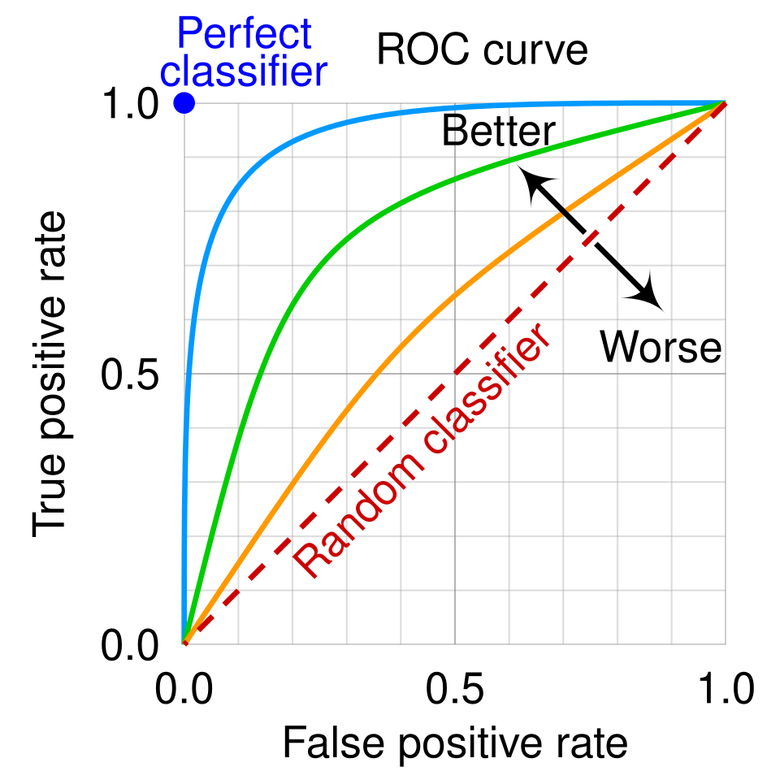

# აბსტრაქტი

ჩვენი პროექტის მიზანია, Machine Learning-ის სფეროში მიღწევები და ახალი ხელსაწყოები გამოვიყენოთ ბიოლოგიური ამოცანის ამოსახსნელად. კონკრეტულად, გვინდა, გავწვრთნათ მოდელი, რომელიც დაისწავლის თუ რა ტიპის დნმ-ის მიმდევრობებს უკავშირდება მოცემული ტრანსკრიფციის ფაქტორი და შემდეგ შეაფასებს binding score-ით ისეთ მიმდევრობებს, რომლებიც აქამდე არასდროს უნახავს. ჩვენი პროექტი დაფუძნებულია 2015 წლის ფუნდამენტურ სამეცნიერო ნაშრომზე **Predicting the sequence specificities of DNA- and RNA-binding proteins by deep learning**(https://www.nature.com/articles/nbt.3300), რომელშიც ავტორებმა შეიმუშავეს CNN მოდელი, სახელად **DeepBind**, და აჩვენეს, რომ ძველ მიდგომებს ბევრად ჯობია სხვადასხვა მეტრიკებით. ჩვენი ვაპირებთ, ჯერ გავიმეოროთ ავტორების ექსპერიმენტი **DREAM5** dataset-ზე და შემდეგ შევეცადოთ მათი მოდელის გაუმჯობესება.

# ექსპერიმენტის რეპლიკაცია

## DREAM5 Dataset-ის აღწერა

DREAM5-ში მოცემულია Protein Binding Microarray(PBM)-ში ჩატარებული ექსპერიმენტის შედეგები, რომელიც გვაჩვენებს თუ რომელ დნმ მონაკვეთებს რა ინტენსივობით უკავშირდება სხვადასხვა ტრანსკრიფციის ფაქტორები. ტრანსკრიფციის ფაქტორებზე დამატებულია ფლუორესცენციური tag-ები. მნათობი ცილები დნმ-ის სხვადასხვა მონაკვეთს უკავშირდება და საბოლოოდ თითოეული 40 ნუკლეოტიდიანი მონაკვეთის ფლუორესცენციის ინტენსივობა ითარგმნება მაგ მონაკვეთის **binding score**-ში. მონაცემების შესაგროვებლად გამოიყენეს ორი სხვადასხვა დიზაინის PBM:

- ME (Mintseris-Eisen)
- HK (Hilal Kazan)

თითოეული დიზაინს თავისი ნაკლები აქვს და მიღებული ინფორმაცია შეიძლება შეიცავდეს არტეფაქტებსა და bias-ებს. ამ პრობლემის გადასაჭრელად DREAM5-ის ავტორები გვთავაზობენ, რომ მოდელი გავწვრთნათ HK-დან მიღებულ training data-ზე და test/validation data-ად გამოვიყენოთ ME-დან მიღებული **binding score**-ები. ამ გზით ვუზრუნველყოფთ, რომ ჩვენი მოდელი PBM დიზაინის არტეფაქტებს არ იზეპირებს.

ზოგიერთ მეტრიკას სჭირდება 0/1 ლეიბელები. 1 კლასში მხოლოდ ისეთი დნმ მონაკვეთები უნდა მოვაქციოთ, რომლებზეც დიდი ალბათობით ვიტყვით, რომ ტრანსკრიფციის ფაქტორი უკავშირდება. DREAM5-ის ავტორები გვთავაზობენ, რომ ნებისმიერი ინტენსივიობა, რომელიც უფრო დიდია ვიდრე $mean + 4*std$, ჩავთვალოთ დადებით კლასში და დანარჩენი კი - უარყოფით კლასში.

## DeepBind მოდელის აღწერა

DeepBind არის Convolutional Neural Network შემდეგი არქიტექტურით:

$$ f(x) = net(MaxPool(ReLU(conv(x)))) $$

დნმ-ის მიმდევრობა რაიმე საშუალებით უნდა გადაკეთდეს **4xN** ზომის მატრიცად და ისე გადაეცეს მოდედლს. მოდელმა უნდა დაამუშაოს მიღებული მიმდევრობა და საბოლოოდ მიანიჭოს **binding score**.

_LaTeX_ ჩანაწერში $net()$ გულისხმობს Fully Connected Network-ს, რომელიც შეიძლება იყოს ერთი ან ორფენიანი.

ასევე, როგორც სტატია აღნიშნავს, რეგულარიზაციისათვის მნიშვნელოვანია, რომ $MaxPool()$ ფენის შემდეგ და, ბოლოს გარდა, ყოველი Fully Connected ფენის შემდეგ დავსვათ $dropout()$ ფენა, რათა თავი დავიცვათ train set-ზე overfit-ისგან.

უკანასკნელი Fully Conneclted ფენის პასუხისმგებლობაა წინა ფენიდან მიღებული ინფორმაცია გადააქციოს სკალარ **binding score**-ად.

## Training-ის აღწერა

**Loss** ფუნქციად, როგორც სტატიაში, გამოვიყენებ **Mean Squared Error(MSE)**-ს მიმდევრობის ნამდვილ binding score-სა და მოდელის predicted binding score-ს შორის.

სტატია გვაფრთხილებს, რომ წონების ინიციალიზაციზე ძალიან სენსიტიურია training და ეს ჩემი ექსპერიმენტებითაც დადასტურდა. ინიციალიზაციის ჰიპერპარამეტრების შესარჩევად ვიყენებ GridSearch-ს პარამეტრების სხვადასხვა კომბინაციაზე, მიღებულ მოდელებსა და შედეგებს ვტვირთავ **WanDB**-ის პლატფორმაზე და შემდეგ ამოვარჩევ საუკეთესო მოდელებს.

ძალზე მნიშვნელოვანია თავიდან ავირიდოთ training data-ზე overfit. მოდელი უნდა გაიწვრთნას ძლიერი რეგულარიზაციით: dropout, weight decay. ამასთანავე, როგორც სტატიის ავტორებმა გვირჩიეს, დავაიმპლემენტირე early stopping, რომელიც აკვირდება ვალიდაციის მონაცემებს და ეპოქის შემდეგ თუ 0.001 threashold-ზე უფრო მეტად გაუარესდა training-ს წყვეტს.

## Evaluation მეტრიკები

**Pearson** - გვიჩვენებს predicted და actual binding score-ებს შორის არსებობს თუ არა წრფივი დამოკიდებულება. თუ pearson=1 predicted და actual ქულები წრფეზე განლაგდებიან.

**ROC Curve და AUC** - მაშინ გამოიყენება, როდესაც გვინდა, რომ 1/0 label მივანიჭოთ მოდელის predicted binding score-ებს. იგი გვიჩვენებს threashold-ის მოძრაობისას, როგორ იცვლება True Positive Rate და False Positive Rate. იდეალურად გვინდა, რომ False Positive-ები არ გვქონდეს და ყველა ნეგატიურ label-ს ძალიან დაბალი binding score მიანიჭოს მოდელმა. ამ შემთხვევაში ROC მრუდის ქვემოთ ფართობი 1.0 იქნება. რეალურად მოდელი უნაკლო არ არის და ზოგ მიმდევრობას მცდარად მიანიჭებს მაღალ binding score-ს. იგი იქნება False Positive. AUC(Area Under the Curve)-ით შეგვიძლია გავიგოთ თუ რამდენად ხშირია ასეთი ტიპის შეცდომები. იგი გასცემს შეკითხვას პასუხს: შემთხვევითად ერთი ნეგატიური ლეიბელის მქონე მიმდევრობა რომ ავიღო და ერთი - პოზიტიური ლეიბელის, რამდენად ხშირად მიანიჭებს მოდელი პოზიტიურ ლეიბელს უფრო მაღალ ქულას. თუ AUC=0.5 მოდელი საერთოდ არ მუშაობს და შემთხვევითად ანიჭებს ქულებს.

_Figure 1. ROC Curve. წყარო: https://en.wikipedia.org/wiki/Receiver_operating_characteristic#/media/File:Roc_curve.svg_

# გამოყენებული რესურსები

## მთავარი სტატია

**Nature Biotechnology:**

https://www.nature.com/articles/nbt.330

**საჯაროდ ხელმისაწვდომი ვერსია(Research Gate):**

https://www.researchgate.net/publication/280496611_Predicting_the_sequence_specificities_of_DNA-_and_RNA-binding_proteins_by_deep_learning

## DREAM5 Challenge Dataset

Challenge-ის დეტალები და Evaluation წესები:

https://pmc.ncbi.nlm.nih.gov/articles/PMC3687085/

Dataset-ის ფაილები აღებულია შემდეგი ლინკიდან:

https://github.com/jisraeli/DeepBind/tree/master/data/dream5
